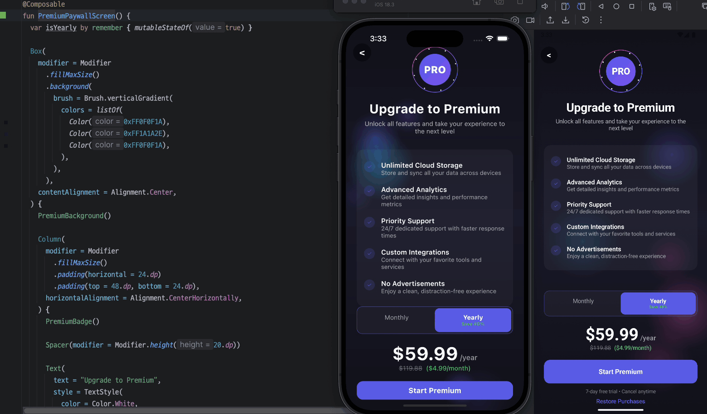
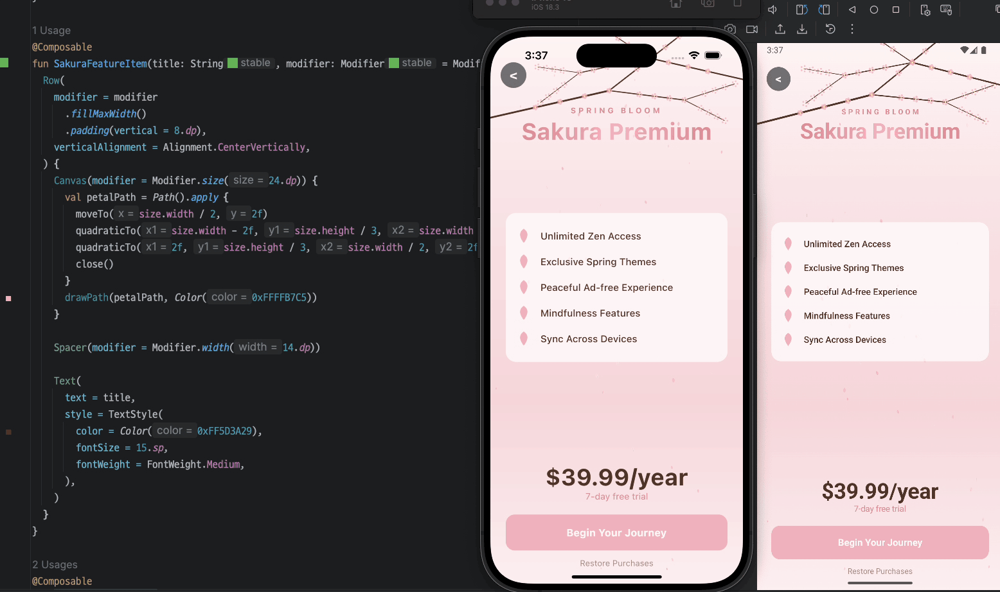
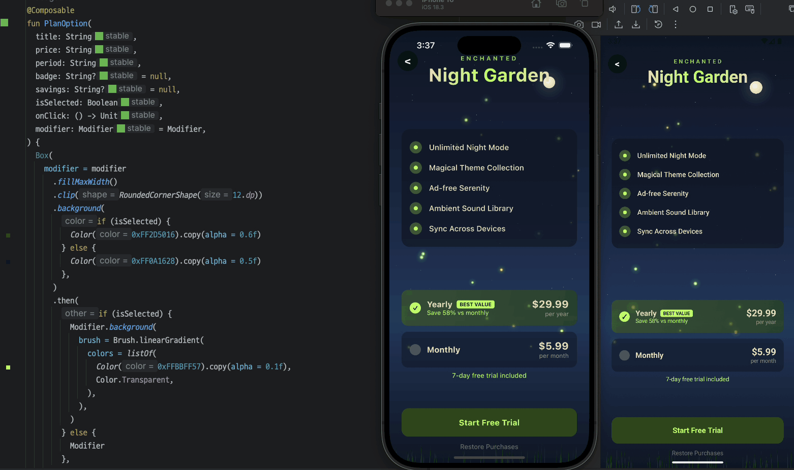

<h1 align="center">Compose Paywall Animations</h1></br>

<p align="center">
  <a href="https://opensource.org/licenses/Apache-2.0"></a>
  <a href="https://android-arsenal.com/api?level=24"></a>
  <a href="https://kotlinlang.org"></a>
  <a href="https://www.jetbrains.com/lp/compose-multiplatform/"></a>
  <a href="https://github.com/RevenueCat/compose-paywall-animations/actions/workflows/build.yml"></a>
</p>

This is a Jetpack Compose project showcasing animations that are built 100% entirely with Jetpack Compose (KMP supports) to inspire your paywalls with more beautiful and engaging components, and ultimately help drive more revenue for Android and iOS. Each paywall features unique animated backgrounds and demonstrates RevenueCat SDK for in-app purchase functionality, including subscription plans and restore purchases.

## Proejct Structures

This is a Kotlin Multiplatform project targeting Android, iOS.

* [/composeApp](./composeApp/src) is for code that will be shared across your Compose Multiplatform applications.
  It contains several subfolders:
  - [commonMain](./composeApp/src/commonMain/kotlin) is for code that’s common for all targets.
  - Other folders are for Kotlin code that will be compiled for only the platform indicated in the folder name.
    For example, if you want to use Apple’s CoreCrypto for the iOS part of your Kotlin app,
    the [iosMain](./composeApp/src/iosMain/kotlin) folder would be the right place for such calls.
    Similarly, if you want to edit the Desktop (JVM) specific part, the [jvmMain](./composeApp/src/jvmMain/kotlin)
    folder is the appropriate location.

* [/iosApp](./iosApp/iosApp) contains iOS applications. Even if you’re sharing your UI with Compose Multiplatform,
  you need this entry point for your iOS app. This is also where you should add SwiftUI code for your project.

## 📷 Previews

### Christmas
Festive holiday paywall with animated snowflakes, glowing Christmas tree, and twinkling ornaments.


You can check out [Build Animated Christmas Paywall in Compose Codelab](https://revenuecat.github.io/codelabs/christmas-paywall.html) for the step by step guides.

### New Year 2026
Celebratory New Year theme with animated fireworks, confetti bursts, and champagne sparkles.


### New Year's Eve Fireworks
Spectacular fireworks display with colorful explosions, particle trails, and countdown celebration vibes.


### Summer
Tropical paradise theme with animated sun rays, floating palm leaves, and ocean wave effects.


### Premium
Elegant premium paywall with subtle golden shimmer effects and luxurious gradient animations.



### Growing Tree
Nature-inspired design featuring an animated tree that grows branches and blooms leaves over time.


### Universe
Cosmic space theme with twinkling stars, floating planets, and mesmerizing nebula animations.


### Day & Night
Dynamic paywall that transitions between day and night with animated sun, moon, and sky gradients.


### Underwater
Ocean depths theme with floating bubbles, swimming fish, and gentle light rays filtering through water.


### Synthwave
Retro 80s aesthetic with neon grid, glowing sun, and pulsing synthwave color gradients.


### Sakura
Japanese cherry blossom theme with falling petals, gentle wind effects, and serene pink aesthetics.



### Fireflies
Enchanted forest atmosphere with glowing fireflies, magical particles, and soft ambient lighting.



### Geometry
Mathematical elegance with pencil-drawn symbols, animated geometric shapes, and educational aesthetics.


### Atomic
Scientific visualization featuring 3D hexagonal atoms, electron orbits, and quantum particle effects.


### Bible
Divine spiritual theme with heavenly light rays, floating doves, shiny cross, and golden particles rising upward.


<a href="https://www.revenuecat.com/docs/getting-started/quickstart?utm_medium=organic&utm_source=github&utm_campaign=advocate">

</a>

## 🐈 RevenueCat In-App Purchase SDK

Cat Paywalls KMP is built using the [RevenueCat SDK for Kotlin Multiplatform](https://github.com/RevenueCat/purchases-kmp) to implement in-app subscriptions and a paywall system on both Android and iOS. [RevenueCat](https://www.revenuecat.com?utm_medium=organic&utm_source=github&utm_campaign=advocate) handles first-party purchases across platforms, manages customer data, supports A/B testing, and provides source-of-truth analytics.

## ✍️ Technical Content

- [Turn Your App into Revenue: Building Paywalls in Android With Jetpack Compose](https://www.revenuecat.com/blog/engineering/build-paywalls-compose/): In-app subscriptions have become a popular way to monetize mobile applications that offer recurring value to users. In this article, you'll learn how to seamlessly implement in-app subscriptions and paywall features in Android using Jetpack Compose and the RevenueCat SDK.
- [How to monetize Android apps with ad-free subscriptions using RevenueCat](https://www.revenuecat.com/blog/engineering/ad-free-subscriptions-android/): Most apps monetize through ads using things like AdMob or Audience Network. To maximize your earnings with ads, you need to show as many of them as possible, which makes for a pretty lousy user experience.
- [Server-driven UI SDK on Android: how RevenueCat enables remote paywalls without app updates](https://www.revenuecat.com/blog/engineering/server-driven-android/): In this article, we'll explore the concept of server-driven UI, with a focus on how RevenueCat's Paywall Editor enables you to build and remotely update paywalls—without needing app updates—using RevenueCat's Android SDK.
- [Simplify in-app purchase unit testing with RevenueCat’s Test Store](https://www.revenuecat.com/blog/engineering/testing-test-store/): In-app purchase testing has long been a pain point in Android development. Setting up Google Play sandbox environments, managing test accounts, waiting for purchase verification, dealing with cached state… the friction is real. Luckily, RevenueCat’s Test Store is a solution to this problem — offering instant testing without the complexity of real billing systems. But the real benefit of Test Store isn’t just its simplified setup, it’s how it enables true unit testing of purchase flows, with minimal infrastructure.

## 💻 [Codelab](https://revenuecat.github.io/)

1. [RevenueCat Google Play Integration](https://revenuecat.github.io/codelab/google-play/codelab-1-google-play-integration/index.html#0): In this codelab, you'll learn how to:
   - Properly configure products on Google Play.
   - Set up the RevenueCat dashboard and connect it to your Google Play products.
   - Understanding Product, Offering, Package, and Entitlement.
   - Create paywalls using the [Paywall Editor](https://www.revenuecat.com/docs/tools/paywalls/creating-paywalls#using-the-editor?utm_medium=organic&utm_source=github&utm_campaign=advocate).

2. [RevenueCat App Store Integration](https://revenuecat.github.io/codelab/app-store/app-store/index.html#0)
   - Properly configure products on App Store Connect.
   - Set up the RevenueCat dashboard and connect it to your App Store products.
   - Understanding Product, Offering, Package, and Entitlement.
   - Create paywalls using the Paywall Editor.

3. [Kotlin Multiplatform Purchases & Paywalls Overview](https://revenuecat.github.io/codelab/kmp/codelab-3-kmp-sdk/index.html#0): In this codelab, you will:
   - Integrate the Android KMP SDK into your project
   - Implement in-app purchases in your Android application
   - Learn how to distinguish between paying and non-paying users
   - Build a paywall screen, which is based on a server-driven UI approach

## 🤝 Contribution

Anyone can contribute and improve this project following the [Contributing Guideline](CONTRIBUTING.md).

## Find this repository useful? 😻

Support it by joining __[stargazers](https://github.com/revenuecat/compose-paywall-animations/stargazers)__ for this repository. :star: <br>
Also, __[follow the main contributor](https://github.com/skydoves)__ on GitHub for the next creations! 🤩

# License
```xml
Copyright (c) 2026 RevenueCat, Inc.

Licensed under the Apache License, Version 2.0 (the "License");
you may not use this file except in compliance with the License.
You may obtain a copy of the License at

   http://www.apache.org/licenses/LICENSE-2.0

Unless required by applicable law or agreed to in writing, software
distributed under the License is distributed on an "AS IS" BASIS,
WITHOUT WARRANTIES OR CONDITIONS OF ANY KIND, either express or implied.
See the License for the specific language governing permissions and
limitations under the License.
```
